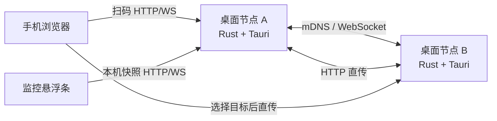
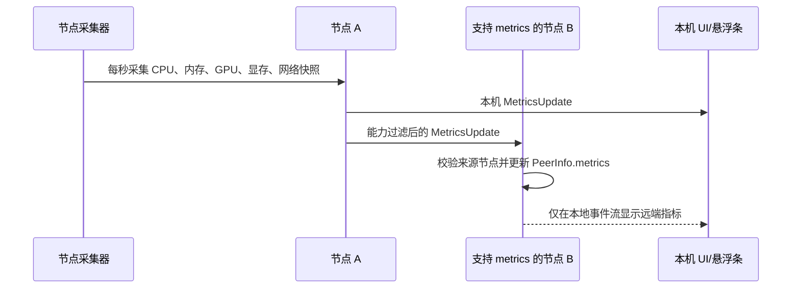
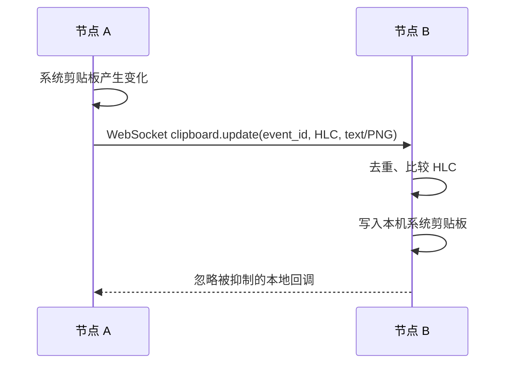
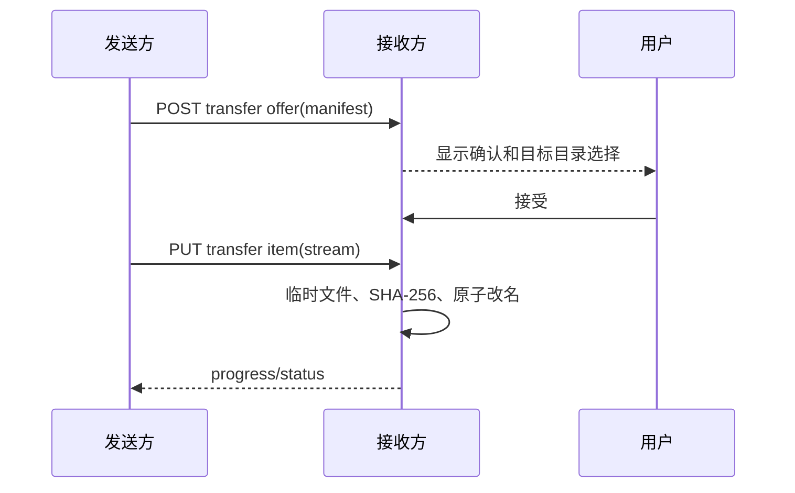

# MeshShare 架构图谱

## 节点拓扑

```mermaid
flowchart LR
  A[桌面节点 A\nRust + Tauri] <-->|mDNS / WebSocket| B[桌面节点 B\nRust + Tauri]
  A <-->|HTTP 直传| B
  P[手机浏览器] -->|扫码 HTTP/WS| A
  P -->|选择目标后直传| B
  M[监控悬浮条] -->|本机快照 HTTP/WS| A
```

## 硬件指标同步

```mermaid
sequenceDiagram
  participant C as 节点采集器
  participant A as 节点 A
  participant B as 支持 metrics 的节点 B
  participant U as 本机 UI/悬浮条
  C->>A: 每秒采集 CPU、内存、GPU、显存、网络快照
  A->>U: 本机 MetricsUpdate
  A->>B: 能力过滤后的 MetricsUpdate
  B->>B: 校验来源节点并更新 PeerInfo.metrics
  B-->>U: 仅在本地事件流显示远端指标
```

指标只保留最新快照。远端超过 5 秒没有更新时标记为过期；GPU/显存读取失败不会影响 CPU、内存和网络指标。

手机通过任意可达节点进入网页。设备列表和传输目标来自节点发现结果；文件内容不会写入共享中心。

## 剪贴板同步

```mermaid
sequenceDiagram
  participant A as 节点 A
  participant B as 节点 B
  A->>A: 系统剪贴板产生变化
  A->>B: WebSocket clipboard.update(event_id, HLC, text/PNG)
  B->>B: 去重、比较 HLC
  B->>B: 写入本机系统剪贴板
  B-->>A: 忽略被抑制的本地回调
```

## 文件直传

```mermaid
sequenceDiagram
  participant S as 发送方
  participant R as 接收方
  S->>R: POST transfer offer(manifest)
  R-->>用户: 显示确认和目标目录选择
  用户->>R: 接受
  S->>R: PUT transfer item(stream)
  R->>R: 临时文件、SHA-256、原子改名
  R-->>S: progress/status
```
