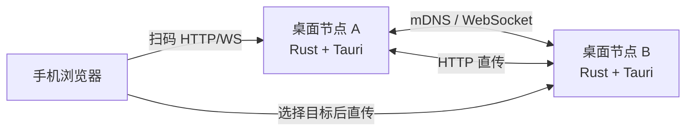
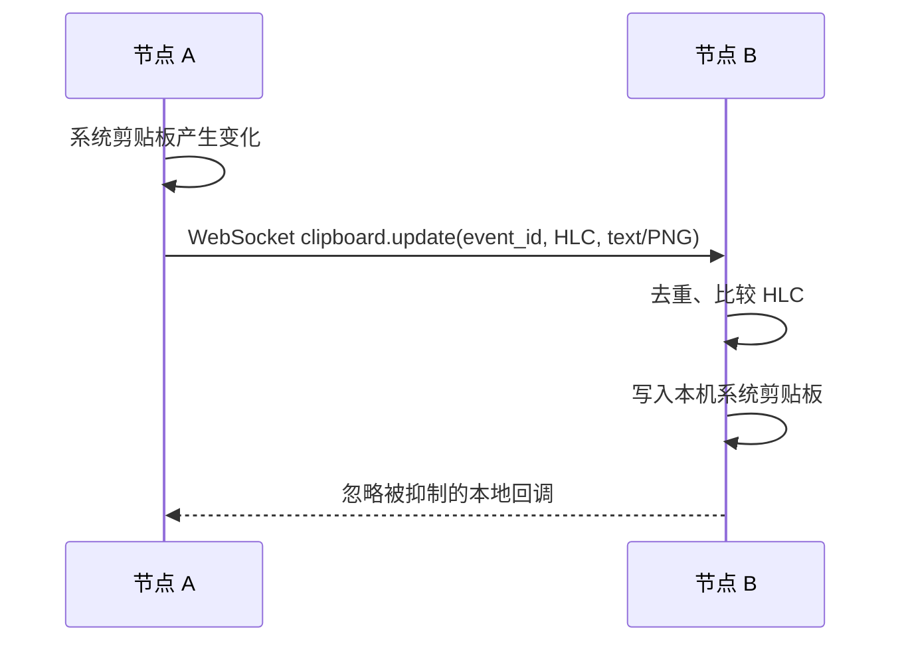
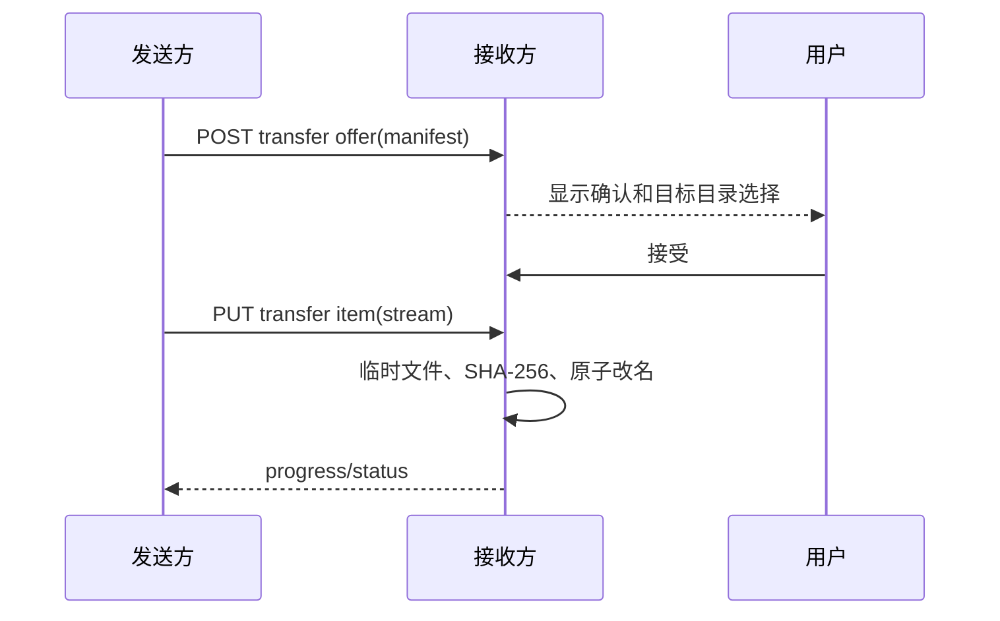

# MeshShare 架构图谱

## 节点拓扑

```mermaid
flowchart LR
  A[桌面节点 A\nRust + Tauri] <-->|mDNS / WebSocket| B[桌面节点 B\nRust + Tauri]
  A <-->|HTTP 直传| B
  P[手机浏览器] -->|扫码 HTTP/WS| A
  P -->|选择目标后直传| B
```

手机通过任意可达节点进入网页。设备列表和传输目标来自节点发现结果；文件内容不会写入共享中心。

## 剪贴板同步

```mermaid
sequenceDiagram
  participant A as 节点 A
  participant B as 节点 B
  A->>A: 系统剪贴板产生变化
  A->>B: WebSocket clipboard.update(event_id, HLC, text/PNG)
  B->>B: 去重、比较 HLC
  B->>B: 写入本机系统剪贴板
  B-->>A: 忽略被抑制的本地回调
```

## 文件直传

```mermaid
sequenceDiagram
  participant S as 发送方
  participant R as 接收方
  S->>R: POST transfer offer(manifest)
  R-->>用户: 显示确认和目标目录选择
  用户->>R: 接受
  S->>R: PUT transfer item(stream)
  R->>R: 临时文件、SHA-256、原子改名
  R-->>S: progress/status
```
